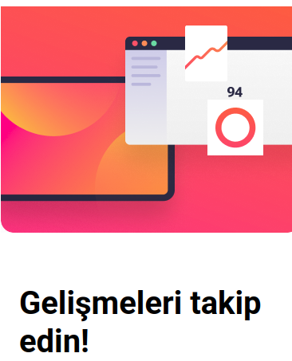

# React + Vite

This template provides a minimal setup to get React working in Vite with HMR and some ESLint rules.

Currently, two official plugins are available:

- [@vitejs/plugin-react](https://github.com/vitejs/vite-plugin-react/blob/main/packages/plugin-react) uses [Oxc](https://oxc.rs)
- [@vitejs/plugin-react-swc](https://github.com/vitejs/vite-plugin-react/blob/main/packages/plugin-react-swc) uses [SWC](https://swc.rs/)

## React Compiler

The React Compiler is not enabled on this template because of its impact on dev & build performances. To add it, see [this documentation](https://react.dev/learn/react-compiler/installation).

## Expanding the ESLint configuration

If you are developing a production application, we recommend using TypeScript with type-aware lint rules enabled. Check out the [TS template](https://github.com/vitejs/vite/tree/main/packages/create-vite/template-react-ts) for information on how to integrate TypeScript and [`typescript-eslint`](https://typescript-eslint.io) in your project.

# TR
# Bülten Abonelik Formu
E-posta doğrulaması, hata yönetimi ve başarı ekranı geçişi içeren, React ile geliştirilmiş tam işlevsel bir bülten abonelik uygulaması.

## Canlı Önizleme

[Proje önizlemesi.](https://dursunkokturk.github.io/React-JS-Project-Newsletter-SignUp-Screen)

## Özellikler

- İki Ekranlı Akış — Abonelik formu ve başarı onay ekranı arasında kesintisiz geçiş
- E-posta Doğrulaması — Boş alan ve geçersiz format kontrolü, regex tabanlı
- Anlık Hata Gösterimi — Hatalı girişte kırmızı border, arka plan rengi ve hata mesajı
- Başarı Ekranı — Girilen e-posta adresiyle kişiselleştirilmiş onay mesajı
- Mesajı Kapat — Başarı ekranından forma dönüş imkânı
- Koşullu Görseller — Mobilde küçük, masaüstünde büyük görsel seti (-big son ekli dosyalar)
- Tam Duyarlı Tasarım — Mobilde dikey kart, masaüstünde yatay iki sütunlu kart düzeni

## Duyarlı Düzenler

| Ekran    | Genişlik         | Düzen                                                   |
| -------- |------------------| --------------------------------------------------------|
| Mobil    | 375px Varsayılan | Dikey: header üstte, form altta                         |
| Masaüstü | ≥ 1109px         | Yatay: form solda, görsel sağda; koyu #36384D arka plan |

## Teknolojiler

| Teknoloji  | Açıklama                                    |
| ---------- |---------------------------------------------|
| React 18   | Bileşen yapısı ve state yönetimi            |
| CSS3       | Flexbox, @media sorguları, CSS değişkenleri |
| JavaScript | E-posta doğrulama (regex)                   |

## Proje Yapısı
src/  
├── App.jsx                          # Ekran geçiş mantığı  
├── App.css                          # Global stiller  
└── assets/  
    ├── Components/  
    │   ├── NewsletterSignupScreen.jsx         # Abonelik formu  
    │   └── NewsletterSignupScreenSuccess.jsx  # Başarı ekranı  
    └── img/  
        ├── background.png / background-big.png  
        ├── tablet.png / tablet-big.png  
        ├── computer-screen.png / computer-screen-big.png  
        ├── grafic.png / grafic-big.png  
        ├── ellipse.png / ellipse-big.png  
        ├── number.png / number-big.png  
        ├── oval.png  
        ├── oval-big.png  
        └── check-big.png  

## Kurulum
bash# Repoyu klonlayın  
git clone https://github.com/dursunkokturk/React-JS-Project-Newsletter-SignUp-Screen.git

### Proje klasörüne girin
cd React-JS-Project-Newsletter-SignUp-Screen

### Bağımlılıkları yükleyin
npm install

### Geliştirme sunucusunu başlatın
npm run dev
Tarayıcınızda http://localhost:5173 adresini açın.

## Uygulama Akışı

- Kullanıcı abonelik formunu görür
- E-posta alanı boş ya da geçersiz bırakılırsa hata mesajı gösterilir
- Geçerli bir e-posta girilip form gönderilirse başarı ekranına geçilir
- Başarı ekranında girilen e-posta adresi görüntülenir
- "Mesajı kapat" butonuyla form başlangıç durumuna döner

## Tasarım Detayları

- Renk Paleti:

  - #242742 — Koyu lacivert (buton, başlık)
  - #36384D — Koyu arka plan (masaüstü body)
  - #FF527B — Pembe vurgu (buton hover)
  - #FF6155 — Kırmızı (hata durumu)
  - #0C7D69 — Yeşil (input focus)

- Font: Roboto

# EN
# Newsletter Sign-Up Form

A fully functional newsletter subscription app built with React, featuring email validation, error handling, and a success screen transition.

## Live Preview

[Project preview.](https://dursunkokturk.github.io/React-JS-Project-Newsletter-SignUp-Screen)

## Features

  - Two-Screen Flow — Seamless transition between the subscription form and success confirmation screen
  - Email Validation — Empty field and invalid format checks, regex-based
  - Instant Error Display — Red border, background color change, and error message on invalid input
  - Success Screen — Personalized confirmation message with the entered email address
  - Dismiss Message — Return to the form from the success screen
  - Conditional Images — Smaller image set on mobile, larger on desktop (files with -big suffix)
  - Fully Responsive Design — Vertical card on mobile, horizontal two-column card layout on desktop

## Responsive Layouts

| Screen  | Width         | Layout                                                            |
| ------- |---------------| ------------------------------------------------------------------|
| Mobile  | 375px Default | Vertical: header on top, form on bottom                           |
| Desktop | ≥ 1109px      | Horizontal: form on left, image on right; dark #36384D background |

## Technologies

| Technology | Description                              |
| ---------- |------------------------------------------|
| React 18   | Component structure and state management |
| CSS3       | Flexbox, @media queries, CSS variables   |
| JavaScript | Email validation (regex)                 |

## Project Structure

src/  
├── App.jsx                          # Screen transition logic  
├── App.css                          # Global styles  
└── assets/  
    ├── Components/  
    │   ├── NewsletterSignupScreen.jsx         # Subscription form  
    │   └── NewsletterSignupScreenSuccess.jsx  # Success screen  
    └── img/  
        ├── background.png / background-big.png  
        ├── tablet.png / tablet-big.png  
        ├── computer-screen.png / computer-screen-big.png  
        ├── grafic.png / grafic-big.png  
        ├── ellipse.png / ellipse-big.png  
        ├── number.png / number-big.png  
        ├── oval.png  
        ├── oval-big.png  
        └── check-big.png  

## Installation
bash

### Clone the repo
git clone https://github.com/dursunkokturk/React-JS-Project-Newsletter-SignUp-Screen.git

### Navigate to the project folder
cd React-JS-Project-Newsletter-SignUp-Screen

### Install dependencies
npm install

### Start the development server
npm run dev

### Open http://localhost:5173 in your browser.

## Application Flow

  - User sees the subscription form
  - If the email field is left empty or invalid, an error message is shown
  - If a valid email is submitted, the user is taken to the success screen
  - The entered email address is displayed on the success screen
  - The "Dismiss message" button resets the form to its initial state

## Design Details

- Color Palette:

  - #242742 — Dark navy (button, heading)
  - #36384D — Dark background (desktop body)
  - #FF527B — Pink accent (button hover)
  - #FF6155 — Red (error state)
  - #0C7D69 — Green (input focus)

- Font: Roboto
